<div align="center">



<br/>

[](https://nodejs.org)
[](https://postgresql.org)
[](https://docs.docker.com/compose)
[](https://trivy.dev)
[](https://semgrep.dev)
[](#license)

**Self-hosted vulnerability scanner for your entire stack.**  
Library CVEs · Dependency trees · Docker images · OS packages · GitHub SAST — one dark dashboard, no SaaS.

</div>

---



<br/>

| | Scanner | What it checks |
|---|---|---|
| 📦 | **Library Scan** | Single package CVEs — OSV + CVSS + EPSS + CISA KEV + PoC |
| 🔗 | **Dependency Scan** | Full transitive dependency tree via deps.dev |
| 🐘 | **Composer Scan** | PHP require tree via Packagist |
| 🐋 | **Image Scan** | Docker image OS + language packages via Trivy |
| 🐧 | **OS Package Scan** | Single package on Ubuntu / Debian / RHEL / Alpine / SUSE |
| 🔍 | **GitHub SAST** | Public repo static analysis via Semgrep |


---

## ☠ Toxic Repo Detection



Every scanned package is checked against a curated blocklist of repositories known to contain malicious or harmful code. If a dependency traces back to one of these repos — you'll know before it reaches production.

| Category | Description |
|---|---|
| 💀 DDoS Tool | Packages designed to flood networks or amplify attacks |
| 🦠 Malware | Trojans, ransomware, or data-stealing payloads |
| ⚡ Hostile Actions | Code that destroys data or sabotages systems |
| 🚫 IP Blocking | Geofencing or censorship embedded in a library |
| 📢 Political Slogan | Activist payloads that hijack package behavior |

---

## Quick Start

```bash
git clone https://github.com/yourname/osa-hunter.git
cd osa-hunter
cp .env.example .env   # add NVD_API_KEY + SESSION_SECRET
docker compose up --build
```

Open **http://localhost:3000** · Default login: `admin` / `admin`

> ⚠️ Change the default password immediately via **avatar → Manage Users**

---



---

## API

All endpoints require a session cookie or `X-Api-Key` header.

```bash
# Library
curl -X POST /api/libscan -H "X-Api-Key: osa_xxxx" \
  -d '{"name":"lodash","ecosystem":"npm","version":"4.17.20"}'

# Docker image
curl -X POST /api/trivy/scan -d '{"image":"nginx","tag":"latest"}'

# GitHub repo
curl -X POST /api/ghscan -d '{"url":"https://github.com/owner/repo"}'
```

Full endpoint list: `libscan` · `depscan` · `composer` · `osscan` · `trivy/scan` · `ghscan` · `scans/history` · `export/pdf`

---

## Configuration

```env
NVD_API_KEY=your-key-here         # nvd.nist.gov/developers/request-an-api-key
SESSION_SECRET=long-random-string # change this
PGPASSWORD=strong-db-password     # change this
```

---

## Security

- Passwords hashed with **bcrypt** (12 rounds)
- API keys stored as **SHA-256 hashes** only
- Login rate-limited — 10 attempts/minute per IP
- `HttpOnly` + `SameSite=lax` cookies
- `X-Frame-Options` · `CSP` · `Referrer-Policy` headers

---

<div align="center">

**[⭐ Star this repo](../../stargazers)** if OSA Hunter caught something in your stack

<sub>Built with ☕ and mild existential dread about open source dependencies</sub>

</div>
